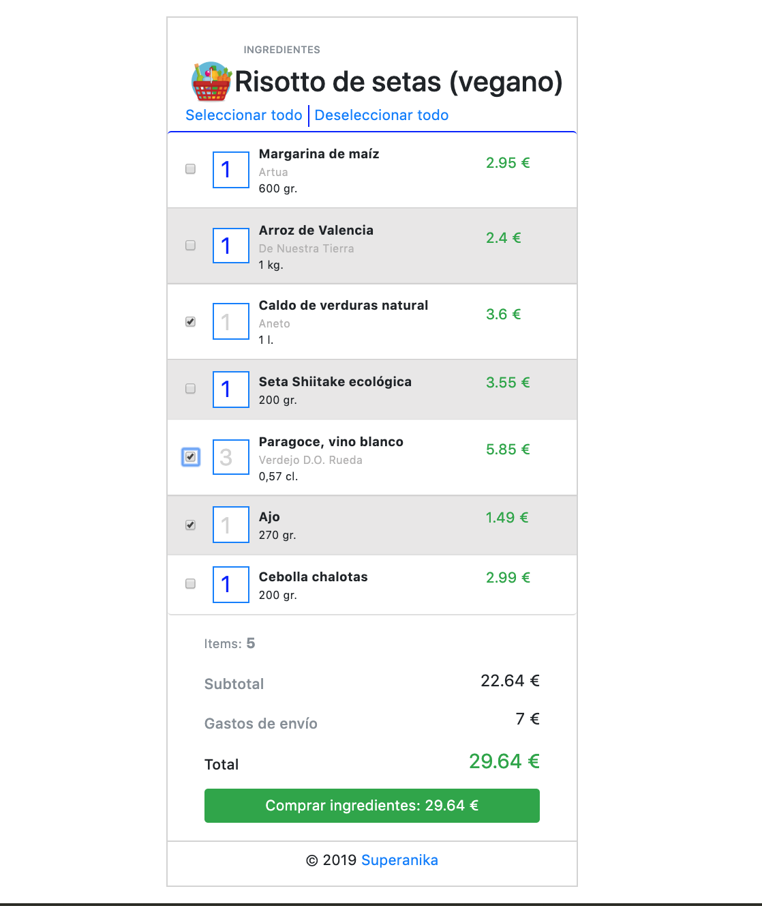

# Risotto de setas

Nuestro mercado favorito tiene un servicio nuevo en el que cada día podemos pedir un plato y nos permite hacer un pedido con
los ingredientes, hoy toca Risotto de setas vegano.

Con esta simple aplicación podrás hacer la compra, seleccionar los ingredientes que quieres comprar y la cantidad de ellos, 
y saber en todo momento cuanto va a ser el coste de la compra.

Está realizada con HTML, CSS, Javascript y con una pequeña ayuda de Bootstrap.

Si te ha gustado, la puedes clonar en el siguiente enlace: https://github.com/Adalab/f-online-risotto-de-setas-superanika.git

 

¡Buen provecho!

